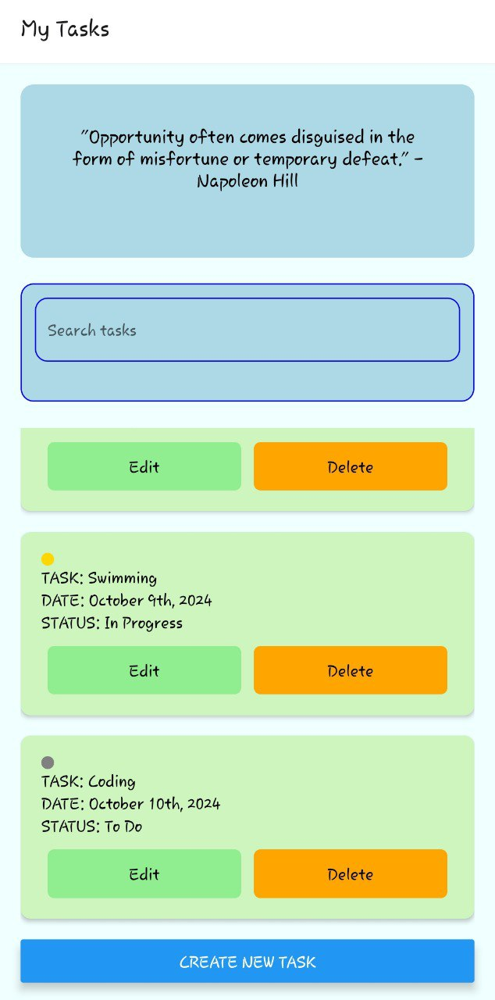
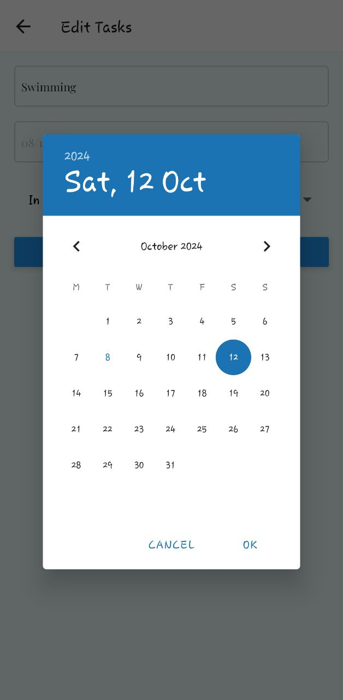
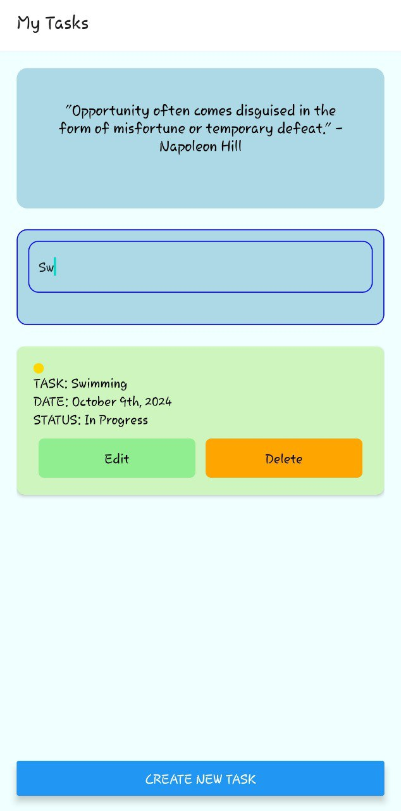

# Introduction
This repository contains work that is done as practical test for the Healthy-u software development test.
 

The aim of the project is to develop a mobile app that is a Task Management App that allows users to create, view,
edit, and delete tasks. The app should be functional on both Android and iOS using React Native with TypeScript. 
 

### Home Screen

### Edit Task 

### Search Task Screen

## Prerequisites

- Node.js
- npm or Yarn
- React Native CLI
- Android Studio (for Android)
- Xcode (for iOS)

## Steps to run the App

git clone <https://github.com/Asega-bryan07/task-management.git>
 

cd `task-management`
 

Run `npm install` or `yarn install`

Make sure to have the Expo Go app installed in your device and run the following command:
`npx expo start -c` or `expo start`
 

### For Android:

Install Android Studio and set up an Android Virtual Device (AVD).
Ensure you have the Android SDK installed and configured.

### For iOS:

Install Xcode from the App Store.
Set up Xcode and ensure you can run the iOS Simulator.

###  limitations faced
running expo on windows web